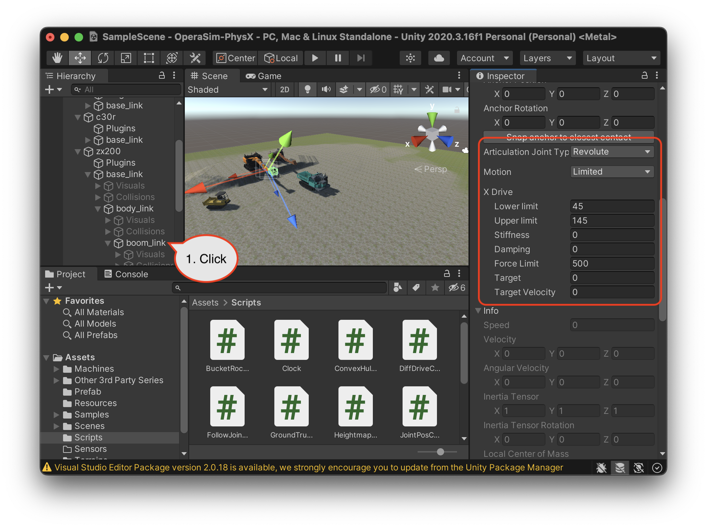
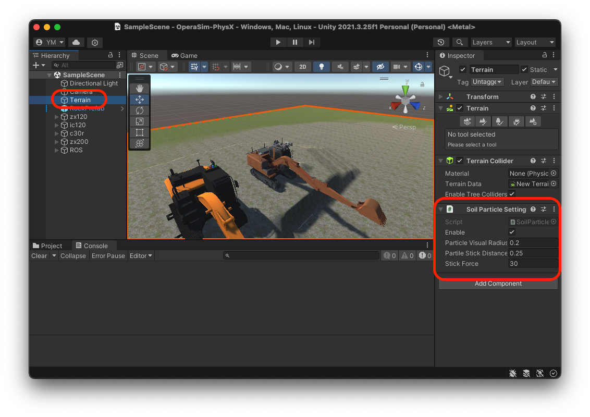

# DART-LLM-Sim

DART-LLM-Sim is a simulation environment component of the DART-LLM (Dependency-Aware Multi-Robot Task Decomposition and Execution) system, built on Unity and PhysX physics engine. It provides a realistic simulation platform for testing and validating multi-robot construction operations. The simulator is part of the OPERA (Open Platform for Earth work with Robotics and Autonomy) development platform and supports ROS/ROS2 integration.

## Features

- **Unity-Based Simulation**
  - Built on Unity 2022.3.4f1
  - Nvidia PhysX physics engine integration
  - Real-time 3D visualization

- **ROS Integration**
  - ROS/ROS2 communication support
  - TCP-based message passing
  - Standardized topic interfaces

- **Robot Models**
  - Hydraulic Excavator simulation
  - Crawler Dump truck simulation
  - Joint control with physics
  - Particle-based soil simulation

## Installation

1. Install Unity Hub and Unity Editor (ver:2022.3.4f1):
   ```bash
   # Download from official Unity website
   https://unity3d.com/get-unity/download
   ```

2. Clone and setup ROS-TCP-Endpoint:
   ```bash
   cd ~/ros2_ws/src
   git clone https://github.com/Unity-Technologies/ROS-TCP-Endpoint.git
   cd ./ROS-TCP-Endpoint/
   ./setup.py
   colcon build
   ```

3. Configure ROS-TCP-Connector in Unity:
   - Set ROS IP Address and Port (default: 10000)
   - Select Protocol (ROS1/ROS2)

## Usage

### Basic Operation

1. Launch ROS endpoint:
   ```bash
   ros2 launch ros_tcp_endpoint endpoint.launch
   ```

2. Click the execute button at the top of Unity Editor:


### ROS Topics

- Commands (ROS → Unity):
  - `/<machine>/tracks/cmd_vel`: Ground speed commands
  - `/<machine>/vessel/cmd`: Dump truck bed control
  - `/<machine>/swing/cmd`: Machine swing control
  - `/<machine>/boom/cmd`: Boom angle control
  - `/<machine>/arm/cmd`: Arm angle control
  - `/<machine>/bucket/cmd`: Bucket angle control

- Feedback (Unity → ROS):
  - `/<machine>/base_link/pose`: Machine coordinates
  - `/<machine>/odom`: Odometry data
  - `/<machine>/joint_states`: Joint states and efforts

## Configuration

The simulator can be configured through:

- **Joint Control Parameters**
  - Stiffness and damping coefficients
  - Motion limits and force limits
  - Solver iterations

- **Particle Simulation Settings**
  - Particle visual properties
  - Physics interaction parameters
  - Soil behavior characteristics


### Tuning Joint Control Parameters

Control parameters for each joint can be modified by changing the XDrive parameters of the game objects.



| Property Name | Description |
| ----  |  ---- |
| Lower Limit | Lower limit of joint motion angle (unit: degree). To enable motion angle limits, set the Motion property to "Limited" |
| Upper Limit | Upper limit of joint motion angle (unit: degree). To enable motion angle limits, set the Motion property to "Limited" |
| Stiffness | Joint stiffness coefficient. See equation below for coefficient meaning. If 0, uses default value 20000 |
| Damping | Joint damping coefficient. See equation below for coefficient meaning. If 0, uses default value 10000 |
| Force Limit | Maximum torque applied during control (unit: newton). If 0, uses default value 10000 |

Stiffness and Damping coefficients are used in the following equation:

Applied Torque = Stiffness * (Drive Position - Target Position) - Damping * (Drive Velocity - Target Velocity)

For more detailed explanations of these parameters, please refer to Unity's official manual:

https://docs.unity3d.com/ja/2023.2/Manual/class-ArticulationBody.html#joint-drive-properties

### Tuning Simulation Parameters When Joint Control Becomes Oscillatory

When simulating multi-joint heavy machinery with long links, joint control may become oscillatory.
This symptom can be mitigated by the following adjustment:

Select `Edit > Project Settings...` from the menu and choose the `Physics` item.


Change the `Default Solver Iterations` property value to a larger number.

### Adjusting Particle Simulation Behavior

Soil particle simulation parameters can be changed in the Soil Particle Setting of the Terrain game object.



| Property Name | Description |
| ----  |  ---- |
| Enable | Uncheck this checkbox if you want to disable soil particle simulation. |
| Particle Visual Radius | Sets the visual radius of particles. To set the radius at which particles interact with each other, also adjust the RockPrefab settings below. |
| Particle Stick Distance | You can recreate soil viscosity by applying attractive forces between nearby particles. This sets the range for generating attractive forces. |
| Stick Force | Sets the strength of attractive forces generated between nearby particles. |

To adjust the radius at which particles interact with surrounding particles, change the Radius value of the Sphere Collider in RockPrefab.

